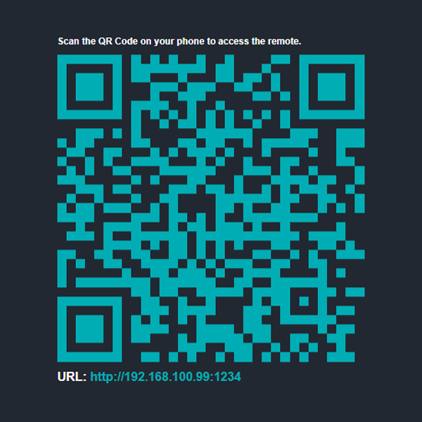
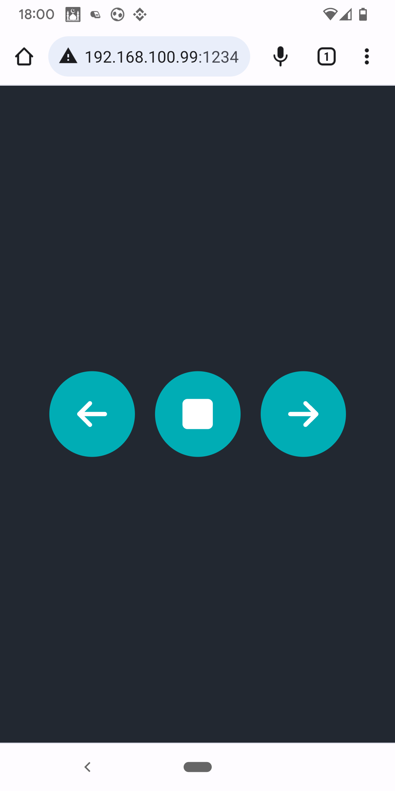
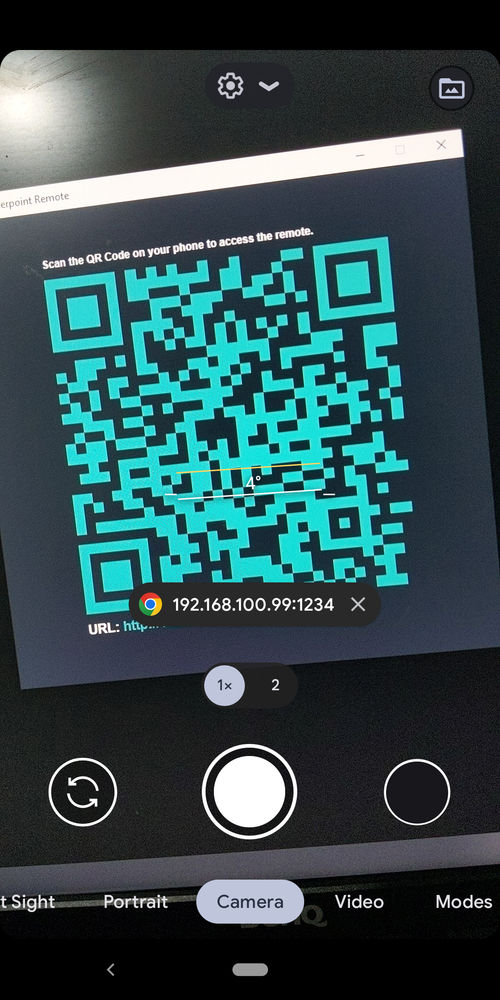

# Powerpoint Remote :video_game:

WIFI Presentation Remote - Control Slides (PowerPoint, Google Sheets) Via a web app.

## Features :dart:
* [x] Free & Open Source.
* [x] Very Easy to use.
* [x] No Internet connection required.
* [x] Multi Platform App.
* [x] Control the Next, Back, Stop of your presentation.

## Languages
* Python
* Javascript, HTML, CSS

## Screenshots
Home           | Remote Control
:---------------------:|:------------------:
 | 
Scan QR Code :camera:

# Thank _You_!
Please :star: this repo to help improve the quality.
